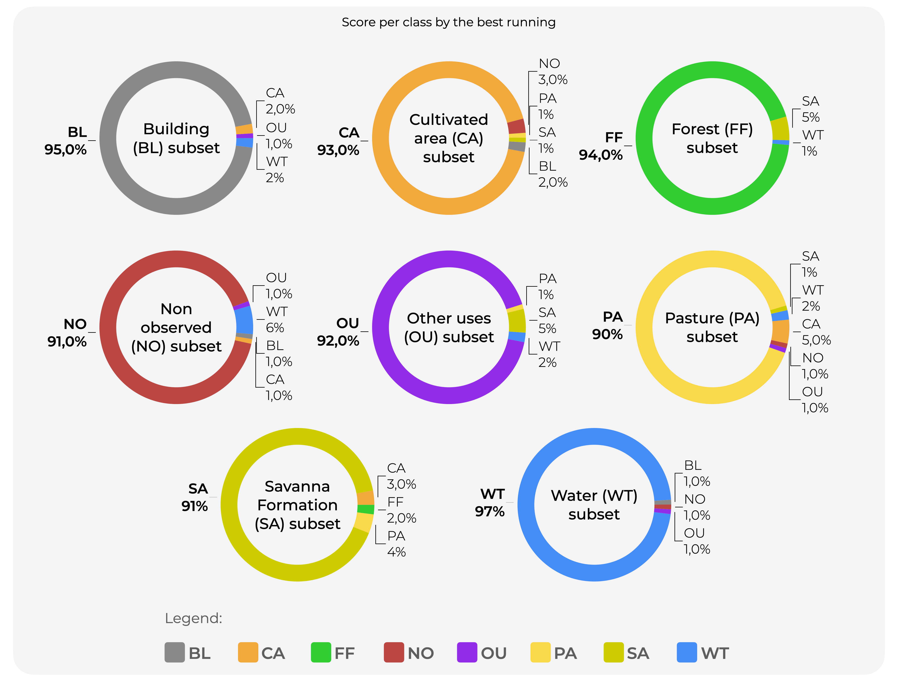

## Contextual classification model module
In the `AIModels/contextual_classification/` directory are the CerraNetv3 and ResNet-50 algorithms written with support from the TensorFlow Framework. These are training algorithms, which save not only the best model in `.hdf5` format, based on the loss rate, at each training epoch, but also the model from the last epoch. The trained model can be found in [Drive](https://drive.google.com/drive/folders/1Dl-VZO95KNmdjjxx_7220sndU0Vje3RP) or in `AIModels/trained_models/`. CerraNetv3 weights are very important to the Smart Mask Labeling (SML) to classify the segments, thus access SML module in `AI4LUC/smart_mask_labeling`. In follows, is presented CerraNetv3's performance scores per class, in terms of contextual classification:

## Pixel-based classification model module
In the `AIModels/semantic_segmentation/` directory are DeepLabv3plus and U-Net algorithms written with support of the Pytorch Framework. These are algorithms for training, which save the model from the last run, in `.pt` format. The trained model can be found in [Drive](https://drive.google.com/drive/folders/1Dl-VZO95KNmdjjxx_7220sndU0Vje3RP).
